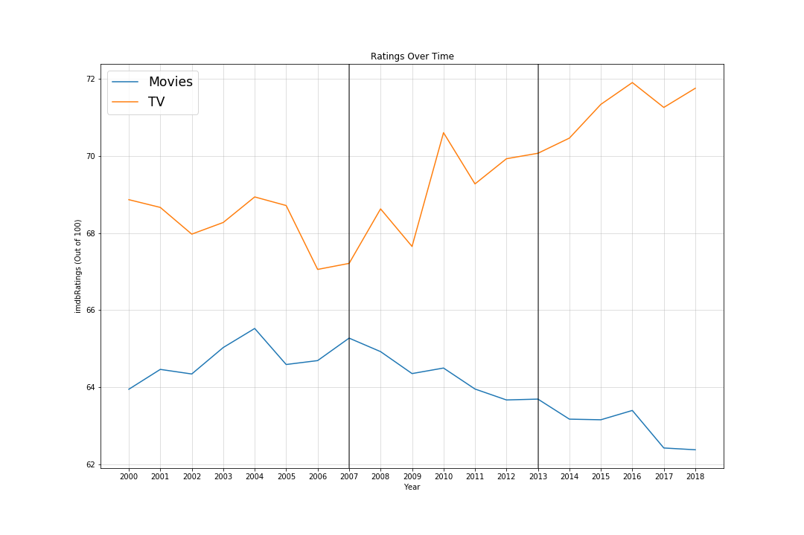
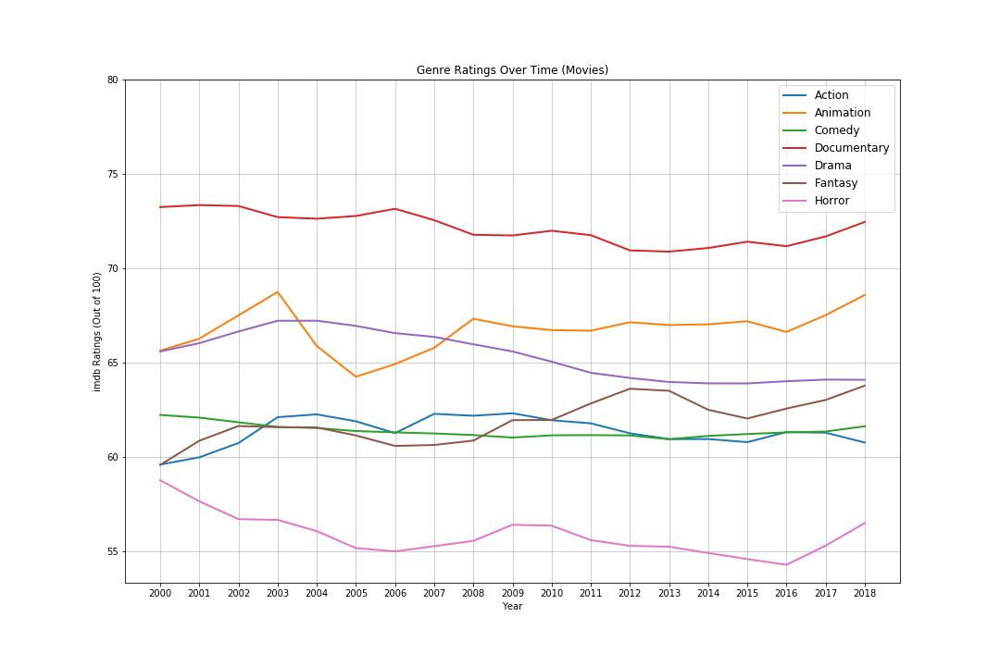
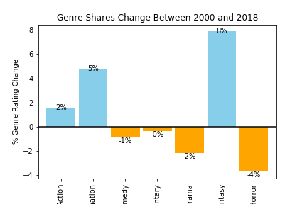
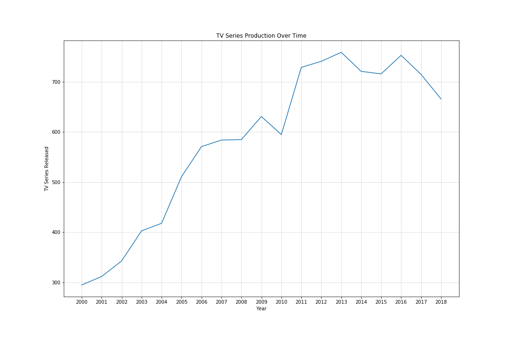
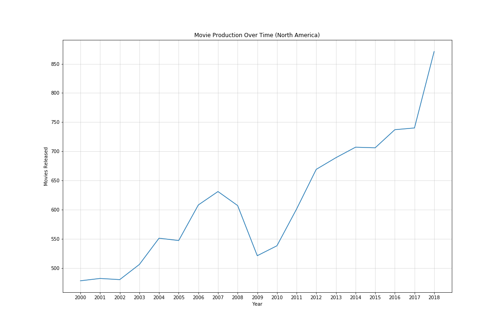
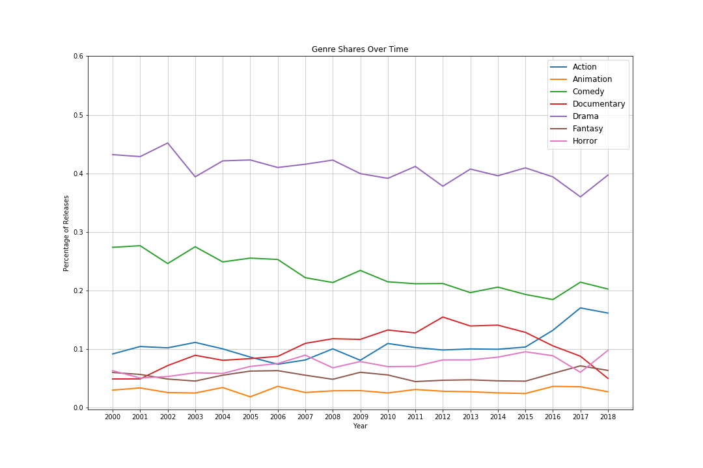
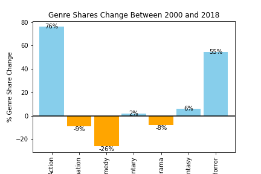
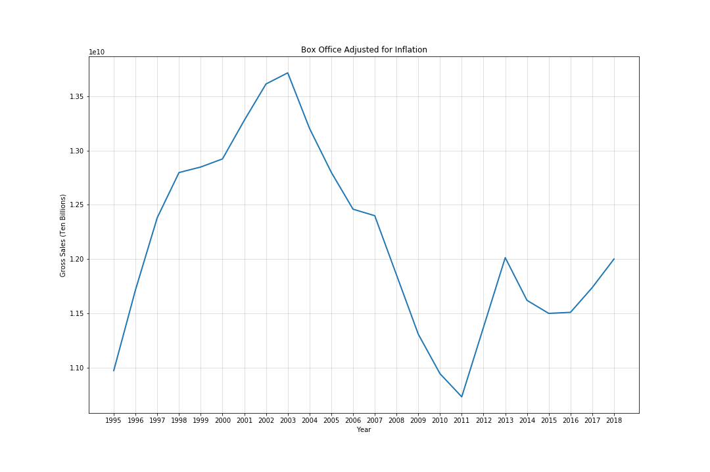
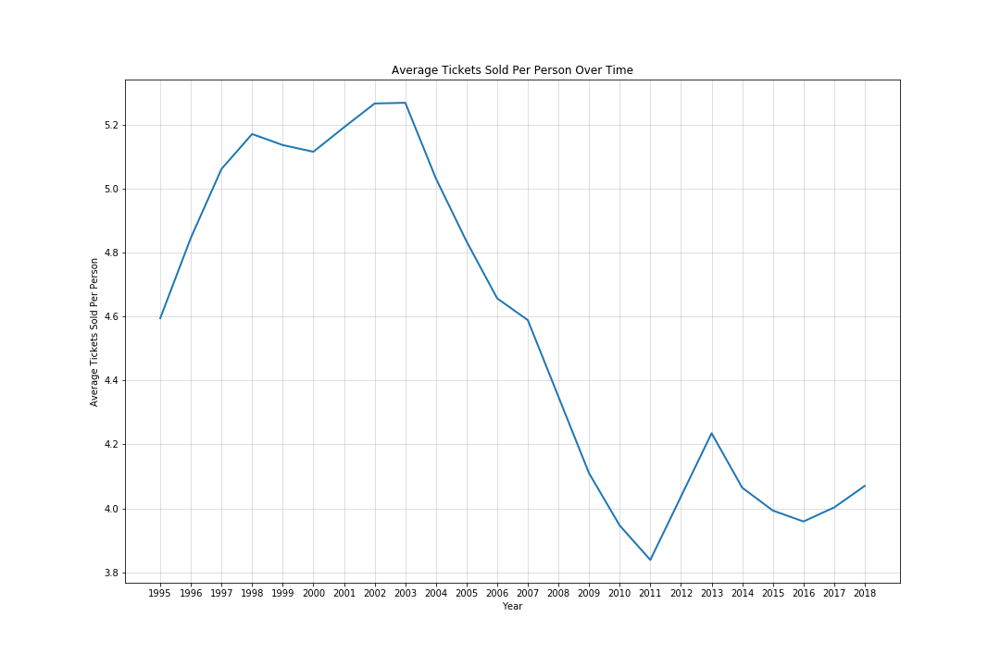

# Have Streaming Services Killed Cinema?

## Introduction

Every month there seem to be less movies showing in theatres that are worth the time and effort to view. Genres have shifted to heavy handed drama and popcorn flicks, and overall quality has declined (based on viewer and critic ratings).This project is interested in the changes in aggregate quality of movies available across all platforms and if it is declining like expected, what is influencing the decline. Of particular interest is the rise in streaming services like Netflix and Hulu.

### Hypothesis

Primary Hypothesis
If the rise in streaming services has contributed to a decrease in cinema quality then mean movie ratings before the year 2011 will be higher than the mean movie ratings after the year 2011.

Primary Null Hypothesis
If the rise in streaming services has not contributed to a decrease in cinema quality then mean movie ratings before the year 2011 will not be higher than the mean movie ratings after the year 2011.

H0 = past mean ratings > current mean ratings

H1 = past mean ratings <= current mean ratings
   
## Description of Data

The bulk of the data used for this project was retrieved from the OMDB API through a series of calls.
http://www.omdbapi.com/

The imdb titles in the first call was taken from a list of movies posted on kaggle.com and formatted before being placed in a list and called with a for loop that built a dataframe from the data retreived from the API. After closer examination of the dataset it was it was decided that the data still desired included details on tv series and movies from the year 2018 as the kaggle csv included neither. These titles were downloaded from imdb as a tab separated and gzipped file.(tsv.gz) The gzip and shutil libraries were used to unzip the files and save as csv files so they could be read into the notebook as a dataframe. The imdb file with IDs and votes was combined to complete the list for the second and third API calls.

The OMDB data was cleaned by correcting the formats of both the rotten tomatoes and imdb ratings so they were consistent for easy comparison.

Because most movies had multiple genres stored as a comma seperated string, some work needed to be done to narrow down what was included for analysis purposes. Each row was first split and expanded to have each genre on its own column and run through a loop to collect a list of unique genres. The resulting list of genres was narrowed from 23 to 7 to make a succinct analysis possible.

In addition to the above data, aggregated data was retrieved from several sources to aid in answering additional questions that arose during the course of analysis.

For revenue analysis:

Box Office Revenue Source: https://www.the-numbers.com/market/

US Population Source: https://www.multpl.com/united-states-population/table/by-year

For accurate movie releases (North America):

https://www.statista.com/statistics/187122/movie-releases-in-north-america-since-2001/

See applicable data dictionary for more information on the datasets. (located in cleaned data folder)

### Limitations of the data

The OMDB dataset presented several challenges. The rotten tomatoes ratings were received in an inconsistent format and required a unique solution though in the end it was clean and usable. The Metacritic ratings and box office series were both missing enough values that they were was not usable for analysis.

Genres

Lack of movie count after 2014

Box office values mostly missing
        
## Analysis/Methodology

### Have ratings changed over time?

To answer the first question the data was grouped by year and plotted against the mean imdb ratings. The vertical lines represent the approximate years that Netflix began to offer streaming and released their first original series.

Ratings were further broken out to determine if any trends could be observed. This was achieved by grouping the cleaned genre data by genre and year and plotting against mean imdb ratings after some minor data munging using unstack and list comprehension to rename the columns

To confirm if there were any large changes in genre ratings, the percentage change between 2000 and 2018 was calculated and visualized with a bar graph.

### Has movie and TV production changed over the same time period?

TV series data was next grouped by year and year and tv count plotted to show change over time.

Because of the limitations in the OMDB dataset and to ensure accuracy, an pre-aggregated statistic was used to show the Movie releases over the same period.

The genre dataset was grouped by genre and year and divided by total per year to produce a change overtime.

The percentage change was visualized in a bar graph to check for noticeable shifts.

### What is the trend for box office revenue over the same time period?

Box office revenue can easily be visualized by plotting figures adjusted for inflation with years to produce the below line graph.

To check that the line was not unduly affected by change in population, the below line graph was produced that shows the average tickets purchased per person in the US based on the tickets sold per year and the US population.

## Results of Analysis

## Conclusions

